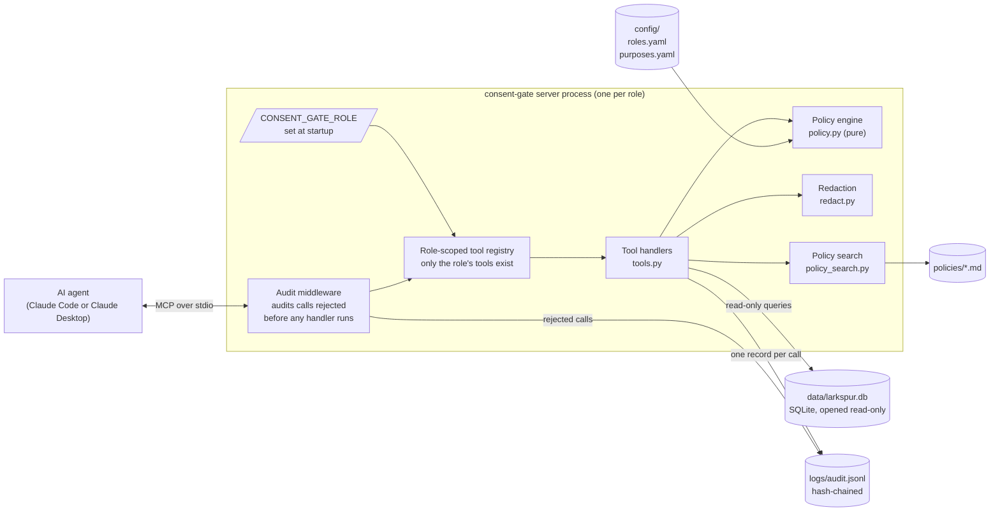
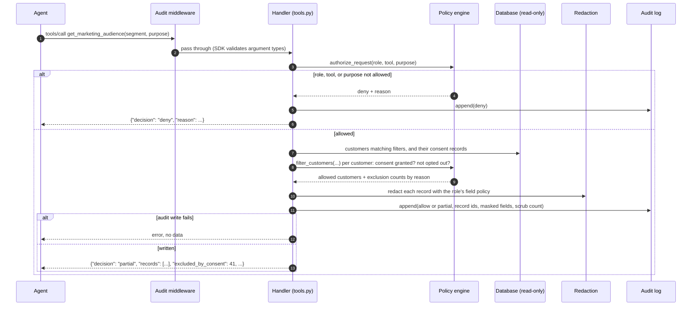

# Architecture

consent-gate is a small, deterministic MCP server. The agent asks; the server decides. No model runs inside the server, and the server makes no network calls.

## Components

| Module | Job | Notes |
|---|---|---|
| `server.py` | Starts the MCP server and registers the role's tools | Role from env only. Unknown role means the process exits with code 2. |
| `tools.py` | One handler per tool | Re-checks policy (defense in depth), validates input, calls the database, redacts, audits. Independent of MCP so it can be tested directly. |
| `policy.py` | Decides allow or deny | Pure functions. A test fails if it imports anything that can do I/O. |
| `redact.py` | Masks SSN and card, scrubs free text, emits only allowed fields | Allowlist: a field not in the role's list is never emitted. |
| `audit.py` | Appends hash-chained records; `verify` command | Cross-process file lock, fsync, fails closed. |
| `db.py` | Read-only SQLite | `mode=ro` URI plus `PRAGMA query_only`. Parameterized queries only. |
| `policy_search.py` | TF-IDF search over policy documents | Offline, built on first use. |
| `config.py`, `models.py` | Load and validate config; shared pydantic models | Config errors stop startup. |

## Request flow

This is a `get_marketing_audience` call from the `marketing_analyst` server.

If the agent calls a tool that does not exist or is not registered for this role, or sends arguments that fail the schema, the MCP SDK rejects the call before any handler runs. The audit middleware notices that no handler wrote an audit record, writes a deny record with the policy reason, and lets the error through. If a successful result ever reached the middleware without an audit record, the middleware would replace it with an error.

## Order of checks

The policy engine applies these checks in a fixed order. The first failure wins.

1. Role is known.
2. Tool is known.
3. Tool is permitted for the role.
4. A purpose is present (customer-data tools only).
5. Purpose is known.
6. Purpose is permitted for the role.
7. Purpose is valid for this tool (`get_marketing_audience` requires `marketing`).
8. Per customer: if the purpose needs consent, there is exactly one consent record for this customer and purpose, and its status is `granted`.
9. Per customer: if the purpose honors the sale/share opt-out (marketing), the customer has not opted out.

The engine reads only `customer_id` and `do_not_sell_or_share` from a customer record. It never reads free text, which is why notes cannot influence a decision. The tests check this directly.

## Key design decisions

- **Policy as data, limits as code.** Roles, purposes, and field lists live in YAML, so a privacy officer can read them. Loading is strict: an unknown tool, purpose, field, or setting stops startup, and SSN and card numbers cannot be configured as anything but last 4. Record caps live in code, so they cannot be raised by editing a file.
- **One server process per role.** The role is fixed for the life of the process. There is no way to switch roles mid-session, because there is no code path that accepts one.
- **Deny responses, not errors.** A policy denial is a normal response with `decision: "deny"` and a short reason, so the agent can explain it to the user. Errors are reserved for failures (audit write failed, database missing), and they never carry data.
- **Do not reveal what was filtered.** Searches report how many customers were excluded by consent, never who. A lookup of a customer who does not exist gets the same message as one excluded by policy. Name searches, and any filter matching fewer than 5 customers, withhold the exclusion count entirely, because they can narrow results to one person.
- **The audit log never stores raw customer data.** It records record IDs, decisions, and reasons. Agent-supplied arguments are scrubbed and length-capped before they are logged.
